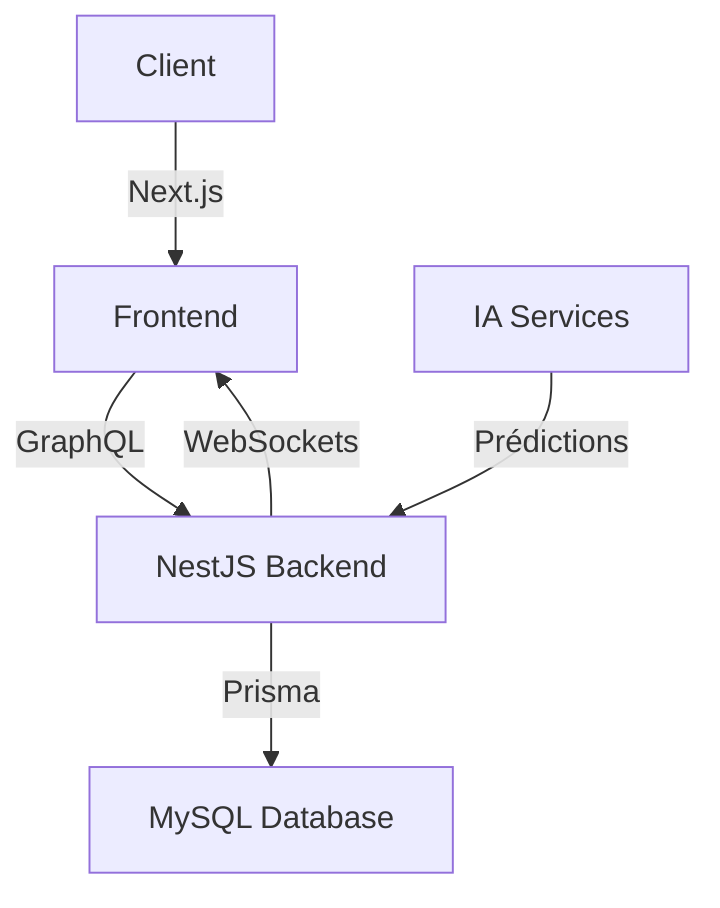
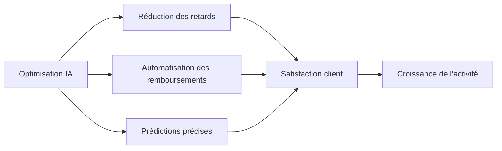

---
# try also 'default' to start simple
theme: seriph
# random image from a curated Unsplash collection by Anthony
background: https://source.unsplash.com/collection/94734566/1920x1080
# apply any windi css classes to the current slide
class: 'text-center'
# https://sli.dev/custom/highlighters.html
highlighter: shiki
# show line numbers in code blocks
lineNumbers: false
# some information about the slides, markdown enabled
info: |
  Présentation du système de suivi des livraisons avec IA
  Créé avec Slidev
# persist drawings in exports and build
drawings:
  persist: false
# use UnoCSS
css: unocss
---

# Système de Suivi des Livraisons avec IA

Une solution innovante pour optimiser la gestion des expéditions

<div class="pt-12">
  <span @click="$slidev.nav.next" class="px-2 py-1 rounded cursor-pointer" hover="bg-white bg-opacity-10">
    Appuyez sur Espace pour la page suivante <carbon:arrow-right class="inline"/>
  </span>
</div>

---
layout: image-right
image: https://images.unsplash.com/photo-1566576721346-d4a3b4eaeb55?q=80&w=2000
---

# 1. Contexte et Objectifs

<v-clicks>

- Améliorer le suivi des livraisons de colis
- Intégrer des technologies avancées et de l'IA
- Optimiser la gestion des expéditions
- Anticiper les retards
- Automatiser le traitement des demandes de remboursement
- Améliorer l'expérience utilisateur avec un tableau de bord interactif

</v-clicks>

---

# 2. Technologies Utilisées

<div grid="~ cols-2 gap-4">
<div>

## Backend
<v-clicks>

- **NestJS** : Framework modulaire et performant
- **GraphQL** : API efficace, charge réseau minimisée
- **MySQL** : Base de données relationnelle robuste
- **Prisma ORM** : Simplification des requêtes SQL
- **WebSockets** : Mises à jour en temps réel
- **JWT** : Sécurisation des connexions

</v-clicks>
</div>
<div>

## Frontend
<v-clicks>

- **Next.js** : Framework React optimisé
- **TailwindCSS** : Stylisation efficace
- **Framer Motion** : Animations fluides
- **Recharts** : Visualisation des données

</v-clicks>

## Infrastructure
<v-clicks>

- **Docker** : Environnement isolé
- **Vercel** : Hébergement frontend et CI/CD
- **Railway** : Hébergement backend et BDD

</v-clicks>
</div>
</div>

---

# 3. Architecture du Projet

<div grid="~ cols-2 gap-4">
<div>

## Base de Données MySQL
<v-clicks>

- Table `users` : Stockage des utilisateurs
- Table `packages` : Informations des colis
- Table `refund_requests` : Gestion des remboursements
- Table `performance_metrics` : Suivi des performances

</v-clicks>

## API GraphQL
<v-clicks>

- `getPackages(userId)`
- `updatePackageStatus(packageId, status)`
- `requestRefund(packageId, reason)`
- `getPerformanceMetrics()`

</v-clicks>
</div>
<div>

## Interface Utilisateur
<v-clicks>

- Tableau de bord interactif
- Suivi des livraisons en temps réel
- Système de filtrage des colis
- Module de gestion des remboursements
- Visualisation des performances

</v-clicks>



</div>
</div>

---

# 4. Rôle de l'IA dans le Projet

<div grid="~ cols-2 gap-4">
<div>

<v-clicks>

- **Analyse prédictive des retards**
  - Basée sur l'historique et les tendances

- **Gestion intelligente des remboursements**
  - Identification des réclamations légitimes

- **Chatbot IA**
  - Assistance pour les problèmes de livraison

</v-clicks>

</div>
<div>

<v-clicks>

- **Recommandations d'amélioration**
  - Optimisation des performances logistiques

- **Génération automatique de contenu**
  - Synthèse des performances en rapports

- **Outils IA utilisés**
  - GPT, Bolt, Synthesia, SlidesAI.io

</v-clicks>

</div>
</div>

<div v-click class="mt-10">

```ts
// Exemple de code pour l'analyse prédictive
function predictDelay(packageData: Package): PredictionResult {
  // Analyse des données historiques
  const historicalData = getHistoricalData(packageData.route);
  
  // Utilisation du modèle IA pour prédire les retards
  return aiModel.predict({
    distance: packageData.distance,
    weather: getCurrentWeather(packageData.route),
    trafficData: getTrafficData(packageData.route),
    historicalPerformance: historicalData
  });
}
```

</div>

---
layout: two-cols
---

# 5. Processus de Développement

<v-clicks>

## Phase 1 : Planification
- Définition des besoins
- Choix des technologies
- Création des maquettes
- Modélisation de la BDD

## Phase 2 : Backend
- API GraphQL avec NestJS
- Mutations et requêtes
- WebSockets pour mises à jour
- Tests unitaires

</v-clicks>

::right::

<v-clicks>

## Phase 3 : Frontend
- Interface avec Next.js
- Tableau de bord et pages de suivi
- Graphiques interactifs
- UX/UI avec TailwindCSS

## Phase 4 : Infrastructure
- Docker pour environnement reproductible
- CI/CD avec GitHub Actions
- Déploiement (Vercel, Railway)
- Monitoring avec Sentry

</v-clicks>

---
layout: image-right
image: https://images.unsplash.com/photo-1555421689-3f034debb7a6?q=80&w=2000
---

# 6. Design et Expérience Utilisateur

<v-clicks>

## Style Glassmorphisme
- Transparence et flou pour effet moderne
- Dégradés subtils pour immersion visuelle

## Interactions
- Animations fluides pour meilleure interactivité
- Icônes et typographie épurées

## Responsive
- Adaptation à tous les appareils
- Expérience cohérente sur mobile et desktop

</v-clicks>

---

# 7. Résultats et Avantages du Projet

<div grid="~ cols-3 gap-4">
<div v-click>

## Optimisation
- Suivi des livraisons en temps réel
- Réduction des délais de traitement
- Meilleure gestion des ressources

</div>
<div v-click>

## Satisfaction Client
- Amélioration du taux de satisfaction
- Transparence accrue
- Réduction des délais de remboursement

</div>
<div v-click>

## Technique
- Interface moderne et performante
- Infrastructure scalable
- Processus de développement agile

</div>
</div>

<div v-click class="mt-10">



</div>

---
layout: center
class: text-center
---

# 8. Conclusion

<v-clicks>

## Une solution innovante, performante et évolutive

- Intégration réussie de l'IA dans le processus logistique
- Technologies modernes pour une expérience utilisateur optimale
- Infrastructure robuste et scalable

## L'IA au service de la logistique

- Analyse des données pour des décisions intelligentes
- Automatisation des processus complexes
- Amélioration continue de l'expérience utilisateur

</v-clicks>

---
layout: center
class: text-center
---

# Merci de votre attention

Des questions ?

<div class="pt-12">
  <span class="px-2 py-1">
    Projet de suivi des livraisons avec IA - 2025
  </span>
</div>