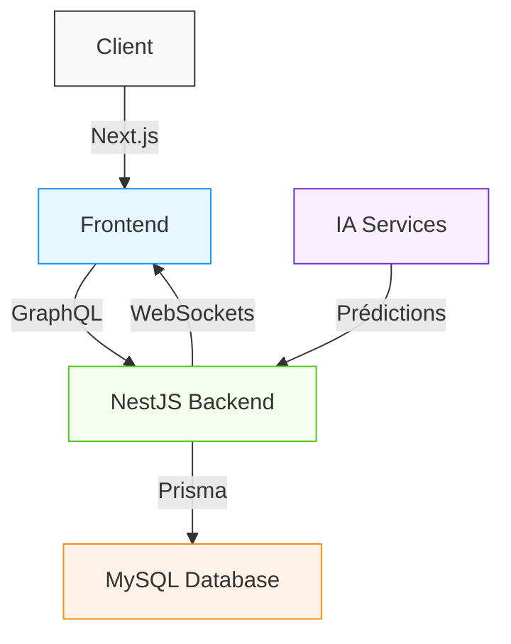
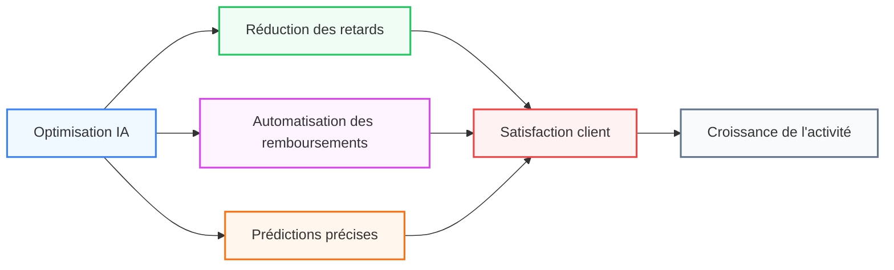

---
# try also 'default' to start simple
theme: seriph
# random image from a curated Unsplash collection by Anthony
background: https://source.unsplash.com/collection/94734566/1920x1080
# apply any windi css classes to the current slide
class: 'text-center'
# https://sli.dev/custom/highlighters.html
highlighter: shiki
# show line numbers in code blocks
lineNumbers: false
# some information about the slides, markdown enabled
info: |
  Présentation du système de suivi des livraisons avec IA
  Créé avec Slidev
# persist drawings in exports and build
drawings:
  persist: false
# use UnoCSS
css: unocss
---

# Système de Suivi des Livraisons avec IA

<div class="text-xl text-gray-200 mb-8">Une solution innovante pour optimiser la gestion des expéditions</div>

<div class="absolute top-0 left-0 right-0 bottom-0 bg-gradient-to-br from-blue-500/20 to-purple-500/20 backdrop-blur-sm rounded-lg z-[-1]"></div>

<div class="pt-12">
  <span @click="$slidev.nav.next" class="px-4 py-2 rounded-full cursor-pointer bg-white/10 backdrop-blur-md border border-white/20 transition duration-300" hover="bg-white/20">
    Commencer <carbon:arrow-right class="inline ml-1"/>
  </span>
</div>

<style>
h1 {
  background-image: linear-gradient(45deg, #4F46E5, #EC4899);
  background-clip: text;
  -webkit-background-clip: text;
  color: transparent;
  font-weight: 700;
}
</style>

---
layout: image-right
image: https://images.unsplash.com/photo-1566576721346-d4a3b4eaeb55?q=80&w=2000
---

# 1. Contexte et Objectifs

<div class="absolute top-10 left-0 right-0 bottom-0 bg-gradient-to-br from-indigo-500/10 to-purple-500/10 backdrop-blur-sm rounded-lg z-[-1] mx-4"></div>

<div class="p-4 rounded-xl bg-white/10 backdrop-blur-md border border-white/20 shadow-xl">
  <v-clicks>
    <div class="flex items-center mb-3">
      <div class="w-8 h-8 rounded-full bg-gradient-to-r from-blue-400 to-blue-600 flex items-center justify-center text-white mr-2">
        <carbon:delivery class="w-4 h-4" />
      </div>
      <div>Améliorer le suivi des livraisons de colis</div>
    </div>
    <div class="flex items-center mb-3">
      <div class="w-8 h-8 rounded-full bg-gradient-to-r from-indigo-400 to-indigo-600 flex items-center justify-center text-white mr-2">
        <carbon:ai-status class="w-4 h-4" />
      </div>
      <div>Intégrer des technologies avancées et de l'IA</div>
    </div>
    <div class="flex items-center mb-3">
      <div class="w-8 h-8 rounded-full bg-gradient-to-r from-purple-400 to-purple-600 flex items-center justify-center text-white mr-2">
        <carbon:target class="w-4 h-4" />
      </div>
      <div>Optimiser la gestion des expéditions</div>
    </div>
    <div class="flex items-center mb-3">
      <div class="w-8 h-8 rounded-full bg-gradient-to-r from-pink-400 to-pink-600 flex items-center justify-center text-white mr-2">
        <carbon:time class="w-4 h-4" />
      </div>
      <div>Anticiper les retards</div>
    </div>
    <div class="flex items-center mb-3">
      <div class="w-8 h-8 rounded-full bg-gradient-to-r from-red-400 to-red-600 flex items-center justify-center text-white mr-2">
        <carbon:currency class="w-4 h-4" />
      </div>
      <div>Automatiser le traitement des remboursements</div>
    </div>
    <div class="flex items-center">
      <div class="w-8 h-8 rounded-full bg-gradient-to-r from-orange-400 to-orange-600 flex items-center justify-center text-white mr-2">
        <carbon:user-profile class="w-4 h-4" />
      </div>
      <div>Améliorer l'expérience utilisateur</div>
    </div>
  </v-clicks>
</div>

<style>
h1 {
  background-image: linear-gradient(45deg, #4F46E5, #EC4899);
  background-clip: text;
  -webkit-background-clip: text;
  color: transparent;
  font-weight: 700;
}
</style>

---

# 2. Technologies Utilisées

<div class="absolute top-0 left-0 right-0 bottom-0 bg-gradient-to-br from-blue-500/10 to-purple-500/10 backdrop-blur-sm rounded-lg z-[-1] m-4"></div>

<div grid="~ cols-2 gap-6">
<div class="p-4 rounded-xl bg-white/10 backdrop-blur-md border border-white/20 shadow-xl">

## Backend
<v-clicks>
<div class="space-y-4">
  <div class="flex items-center">
    <div class="w-12 h-12 rounded-full bg-gradient-to-r from-red-400 to-red-600 flex items-center justify-center text-white mr-3">
      
    </div>
    <div><strong>NestJS</strong> : Framework modulaire et performant</div>
  </div>
  <div class="flex items-center">
    <div class="w-12 h-12 rounded-full bg-gradient-to-r from-pink-400 to-pink-600 flex items-center justify-center text-white mr-3">
      
    </div>
    <div><strong>GraphQL</strong> : API efficace, charge réseau minimisée</div>
  </div>
  <div class="flex items-center">
    <div class="w-12 h-12 rounded-full bg-gradient-to-r from-blue-400 to-blue-600 flex items-center justify-center text-white mr-3">
      
    </div>
    <div><strong>MySQL</strong> : Base de données relationnelle robuste</div>
  </div>
  <div class="flex items-center">
    <div class="w-12 h-12 rounded-full bg-gradient-to-r from-indigo-400 to-indigo-600 flex items-center justify-center text-white mr-3">
      
    </div>
    <div><strong>Prisma ORM</strong> : Simplification des requêtes SQL</div>
  </div>
  <div class="flex items-center">
    <div class="w-12 h-12 rounded-full bg-gradient-to-r from-purple-400 to-purple-600 flex items-center justify-center text-white mr-3">
      <carbon:network-4 class="w-8 h-8" />
    </div>
    <div><strong>WebSockets</strong> : Mises à jour en temps réel</div>
  </div>
</div>
</v-clicks>
</div>

<div>
<div class="p-4 rounded-xl bg-white/10 backdrop-blur-md border border-white/20 shadow-xl mb-4">

## Frontend
<v-clicks>
<div class="space-y-4">
  <div class="flex items-center">
    <div class="w-12 h-12 rounded-full bg-gradient-to-r from-blue-400 to-blue-600 flex items-center justify-center text-white mr-3">
      
    </div>
    <div><strong>Next.js</strong> : Framework React optimisé</div>
  </div>
  <div class="flex items-center">
    <div class="w-12 h-12 rounded-full bg-gradient-to-r from-cyan-400 to-cyan-600 flex items-center justify-center text-white mr-3">
      
    </div>
    <div><strong>TailwindCSS</strong> : Stylisation efficace</div>
  </div>
  <div class="flex items-center">
    <div class="w-12 h-12 rounded-full bg-gradient-to-r from-purple-400 to-purple-600 flex items-center justify-center text-white mr-3">
      
    </div>
    <div><strong>Framer Motion</strong> : Animations fluides</div>
  </div>
  <div class="flex items-center">
    <div class="w-12 h-12 rounded-full bg-gradient-to-r from-green-400 to-green-600 flex items-center justify-center text-white mr-3">
      
    </div>
    <div><strong>Recharts</strong> : Visualisation des données</div>
  </div>
</div>
</v-clicks>
</div>

<div class="p-4 rounded-xl bg-white/10 backdrop-blur-md border border-white/20 shadow-xl">

## Infrastructure
<v-clicks>
<div class="space-y-4">
  <div class="flex items-center">
    <div class="w-12 h-12 rounded-full bg-gradient-to-r from-blue-400 to-blue-600 flex items-center justify-center text-white mr-3">
      
    </div>
    <div><strong>Docker</strong> : Environnement isolé</div>
  </div>
  <div class="flex items-center">
    <div class="w-12 h-12 rounded-full bg-gradient-to-r from-black-400 to-gray-600 flex items-center justify-center text-white mr-3">
      
    </div>
    <div><strong>Vercel</strong> : Hébergement frontend et CI/CD</div>
  </div>
  <div class="flex items-center">
    <div class="w-12 h-12 rounded-full bg-gradient-to-r from-purple-400 to-purple-600 flex items-center justify-center text-white mr-3">
      
    </div>
    <div><strong>Railway</strong> : Hébergement backend et BDD</div>
  </div>
</div>
</v-clicks>
</div>
</div>
</div>

<style>
h1 {
  background-image: linear-gradient(45deg, #4F46E5, #EC4899);
  background-clip: text;
  -webkit-background-clip: text;
  color: transparent;
  font-weight: 700;
}
</style>

---

# 3. Architecture du Projet

<div class="absolute top-0 left-0 right-0 bottom-0 bg-gradient-to-br from-indigo-500/10 to-purple-500/10 backdrop-blur-sm rounded-lg z-[-1] m-4"></div>

<div grid="~ cols-2 gap-6">
<div>
<div class="p-4 rounded-xl bg-white/10 backdrop-blur-md border border-white/20 shadow-xl mb-4">

## Base de Données MySQL
<v-clicks>
<div class="space-y-3">
  <div class="flex items-center">
    <div class="w-10 h-10 rounded-full bg-gradient-to-r from-blue-400 to-blue-600 flex items-center justify-center text-white mr-3">
      <carbon:user class="w-6 h-6" />
    </div>
    <div>Table <code class="px-1 py-0.5 rounded bg-white/20">users</code> : Stockage des utilisateurs</div>
  </div>
  <div class="flex items-center">
    <div class="w-10 h-10 rounded-full bg-gradient-to-r from-indigo-400 to-indigo-600 flex items-center justify-center text-white mr-3">
      <carbon:delivery class="w-6 h-6" />
    </div>
    <div>Table <code class="px-1 py-0.5 rounded bg-white/20">packages</code> : Informations des colis</div>
  </div>
  <div class="flex items-center">
    <div class="w-10 h-10 rounded-full bg-gradient-to-r from-purple-400 to-purple-600 flex items-center justify-center text-white mr-3">
      <carbon:currency class="w-6 h-6" />
    </div>
    <div>Table <code class="px-1 py-0.5 rounded bg-white/20">refund_requests</code> : Gestion des remboursements</div>
  </div>
  <div class="flex items-center">
    <div class="w-10 h-10 rounded-full bg-gradient-to-r from-pink-400 to-pink-600 flex items-center justify-center text-white mr-3">
      <carbon:chart-line class="w-6 h-6" />
    </div>
    <div>Table <code class="px-1 py-0.5 rounded bg-white/20">performance_metrics</code> : Suivi des performances</div>
  </div>
</div>
</v-clicks>
</div>

<div class="p-4 rounded-xl bg-white/10 backdrop-blur-md border border-white/20 shadow-xl">

## API GraphQL
<v-clicks>
<div class="space-y-3">
  <div class="flex items-center">
    <div class="w-10 h-10 rounded-full bg-gradient-to-r from-green-400 to-green-600 flex items-center justify-center text-white mr-3">
      <carbon:data-view class="w-6 h-6" />
    </div>
    <div><code class="px-1 py-0.5 rounded bg-white/20">getPackages(userId)</code></div>
  </div>
  <div class="flex items-center">
    <div class="w-10 h-10 rounded-full bg-gradient-to-r from-teal-400 to-teal-600 flex items-center justify-center text-white mr-3">
      <carbon:update-now class="w-6 h-6" />
    </div>
    <div><code class="px-1 py-0.5 rounded bg-white/20">updatePackageStatus(packageId, status)</code></div>
  </div>
  <div class="flex items-center">
    <div class="w-10 h-10 rounded-full bg-gradient-to-r from-cyan-400 to-cyan-600 flex items-center justify-center text-white mr-3">
      <carbon:request-quote class="w-6 h-6" />
    </div>
    <div><code class="px-1 py-0.5 rounded bg-white/20">requestRefund(packageId, reason)</code></div>
  </div>
  <div class="flex items-center">
    <div class="w-10 h-10 rounded-full bg-gradient-to-r from-blue-400 to-blue-600 flex items-center justify-center text-white mr-3">
      <carbon:analytics class="w-6 h-6" />
    </div>
    <div><code class="px-1 py-0.5 rounded bg-white/20">getPerformanceMetrics()</code></div>
  </div>
</div>
</v-clicks>
</div>
</div>

<div>
<div class="p-4 rounded-xl bg-white/10 backdrop-blur-md border border-white/20 shadow-xl mb-4">

## Interface Utilisateur
<v-clicks>
<div class="space-y-3">
  <div class="flex items-center">
    <div class="w-10 h-10 rounded-full bg-gradient-to-r from-orange-400 to-orange-600 flex items-center justify-center text-white mr-3">
      <carbon:dashboard class="w-6 h-6" />
    </div>
    <div>Tableau de bord interactif</div>
  </div>
  <div class="flex items-center">
    <div class="w-10 h-10 rounded-full bg-gradient-to-r from-amber-400 to-amber-600 flex items-center justify-center text-white mr-3">
      <carbon:location-current class="w-6 h-6" />
    </div>
    <div>Suivi des livraisons en temps réel</div>
  </div>
  <div class="flex items-center">
    <div class="w-10 h-10 rounded-full bg-gradient-to-r from-yellow-400 to-yellow-600 flex items-center justify-center text-white mr-3">
      <carbon:filter class="w-6 h-6" />
    </div>
    <div>Système de filtrage des colis</div>
  </div>
  <div class="flex items-center">
    <div class="w-10 h-10 rounded-full bg-gradient-to-r from-lime-400 to-lime-600 flex items-center justify-center text-white mr-3">
      <carbon:money class="w-6 h-6" />
    </div>
    <div>Module de gestion des remboursements</div>
  </div>
  <div class="flex items-center">
    <div class="w-10 h-10 rounded-full bg-gradient-to-r from-green-400 to-green-600 flex items-center justify-center text-white mr-3">
      <carbon:chart-multitype class="w-6 h-6" />
    </div>
    <div>Visualisation des performances</div>
  </div>
</div>
</v-clicks>
</div>

<div class="p-4 rounded-xl bg-white/10 backdrop-blur-md border border-white/20 shadow-xl">



</div>
</div>
</div>

<style>
h1 {
  background-image: linear-gradient(45deg, #4F46E5, #EC4899);
  background-clip: text;
  -webkit-background-clip: text;
  color: transparent;
  font-weight: 700;
}
</style>

---

# 4. Rôle de l'IA dans le Projet

<div class="absolute top-0 left-0 right-0 bottom-0 bg-gradient-to-br from-blue-500/10 to-purple-500/10 backdrop-blur-sm rounded-lg z-[-1] m-4"></div>

<div grid="~ cols-2 gap-6">
<div>
<div class="p-4 rounded-xl bg-white/10 backdrop-blur-md border border-white/20 shadow-xl space-y-4">

<v-clicks>
<div>
  <div class="flex items-center mb-2">
    <div class="w-12 h-12 rounded-full bg-gradient-to-r from-blue-400 to-blue-600 flex items-center justify-center text-white mr-3">
      <carbon:chart-line-data class="w-7 h-7" />
    </div>
    <div class="font-bold">Analyse prédictive des retards</div>
  </div>
  <div class="ml-15 text-sm opacity-80">Basée sur l'historique et les tendances</div>
</div>

<div>
  <div class="flex items-center mb-2">
    <div class="w-12 h-12 rounded-full bg-gradient-to-r from-green-400 to-green-600 flex items-center justify-center text-white mr-3">
      <carbon:money class="w-7 h-7" />
    </div>
    <div class="font-bold">Gestion intelligente des remboursements</div>
  </div>
  <div class="ml-15 text-sm opacity-80">Identification des réclamations légitimes</div>
</div>

<div>
  <div class="flex items-center mb-2">
    <div class="w-12 h-12 rounded-full bg-gradient-to-r from-purple-400 to-purple-600 flex items-center justify-center text-white mr-3">
      <carbon:chat-bot class="w-7 h-7" />
    </div>
    <div class="font-bold">Chatbot IA</div>
  </div>
  <div class="ml-15 text-sm opacity-80">Assistance pour les problèmes de livraison</div>
</div>
</v-clicks>

</div>
</div>

<div>
<div class="p-4 rounded-xl bg-white/10 backdrop-blur-md border border-white/20 shadow-xl space-y-4">

<v-clicks>
<div>
  <div class="flex items-center mb-2">
    <div class="w-12 h-12 rounded-full bg-gradient-to-r from-amber-400 to-amber-600 flex items-center justify-center text-white mr-3">
      <carbon:idea class="w-7 h-7" />
    </div>
    <div class="font-bold">Recommandations d'amélioration</div>
  </div>
  <div class="ml-15 text-sm opacity-80">Optimisation des performances logistiques</div>
</div>

<div>
  <div class="flex items-center mb-2">
    <div class="w-12 h-12 rounded-full bg-gradient-to-r from-red-400 to-red-600 flex items-center justify-center text-white mr-3">
      <carbon:document class="w-7 h-7" />
    </div>
    <div class="font-bold">Génération automatique de contenu</div>
  </div>
  <div class="ml-15 text-sm opacity-80">Synthèse des performances en rapports</div>
</div>

<div>
  <div class="flex items-center mb-2">
    <div class="w-12 h-12 rounded-full bg-gradient-to-r from-indigo-400 to-indigo-600 flex items-center justify-center text-white mr-3">
      <carbon:tools-alt class="w-7 h-7" />
    </div>
    <div class="font-bold">Outils IA utilisés</div>
  </div>
  <div class="ml-15 text-sm opacity-80 flex space-x-2">
    
    
    
    <span>GPT, Synthesia, SlidesAI.io</span>
  </div>
</div>
</v-clicks>

</div>
</div>
</div>

<div v-click class="mt-6">
<div class="p-4 rounded-xl bg-white/10 backdrop-blur-md border border-white/20 shadow-xl">

```ts {all|4|7-12|14}
// Exemple de code pour l'analyse prédictive
function predictDelay(packageData: Package): PredictionResult {
  // Analyse des données historiques
  const historicalData = getHistoricalData(packageData.route);
  
  // Utilisation du modèle IA pour prédire les retards
  return aiModel.predict({
    distance: packageData.distance,
    weather: getCurrentWeather(packageData.route),
    trafficData: getTrafficData(packageData.route),
    historicalPerformance: historicalData
  });
}
```

</div>
</div>

<style>
h1 {
  background-image: linear-gradient(45deg, #4F46E5, #EC4899);
  background-clip: text;
  -webkit-background-clip: text;
  color: transparent;
  font-weight: 700;
}
</style>

---
layout: two-cols
---

# 5. Processus de Développement

<div class="absolute top-0 left-0 right-0 bottom-0 bg-gradient-to-br from-indigo-500/10 to-purple-500/10 backdrop-blur-sm rounded-lg z-[-1] m-4"></div>

<div class="p-4 rounded-xl bg-white/10 backdrop-blur-md border border-white/20 shadow-xl mb-4">

<v-clicks>

## Phase 1 : Planification
<div class="space-y-3 ml-2 mb-4">
  <div class="flex items-center">
    <div class="w-10 h-10 rounded-full bg-gradient-to-r from-blue-400 to-blue-600 flex items-center justify-center text-white mr-3">
      <carbon:task class="w-6 h-6" />
    </div>
    <div>Définition des besoins</div>
  </div>
  <div class="flex items-center">
    <div class="w-10 h-10 rounded-full bg-gradient-to-r from-indigo-400 to-indigo-600 flex items-center justify-center text-white mr-3">
      <carbon:choice class="w-6 h-6" />
    </div>
    <div>Choix des technologies</div>
  </div>
  <div class="flex items-center">
    <div class="w-10 h-10 rounded-full bg-gradient-to-r from-purple-400 to-purple-600 flex items-center justify-center text-white mr-3">
      <carbon:sketch class="w-6 h-6" />
    </div>
    <div>Création des maquettes</div>
  </div>
  <div class="flex items-center">
    <div class="w-10 h-10 rounded-full bg-gradient-to-r from-pink-400 to-pink-600 flex items-center justify-center text-white mr-3">
      <carbon:data-base class="w-6 h-6" />
    </div>
    <div>Modélisation de la BDD</div>
  </div>
</div>

## Phase 2 : Backend
<div class="space-y-3 ml-2">
  <div class="flex items-center">
    <div class="w-10 h-10 rounded-full bg-gradient-to-r from-red-400 to-red-600 flex items-center justify-center text-white mr-3">
      <carbon:api class="w-6 h-6" />
    </div>
    <div>API GraphQL avec NestJS</div>
  </div>
  <div class="flex items-center">
    <div class="w-10 h-10 rounded-full bg-gradient-to-r from-orange-400 to-orange-600 flex items-center justify-center text-white mr-3">
      <carbon:data-refinery class="w-6 h-6" />
    </div>
    <div>Mutations et requêtes</div>
  </div>
  <div class="flex items-center">
    <div class="w-10 h-10 rounded-full bg-gradient-to-r from-amber-400 to-amber-600 flex items-center justify-center text-white mr-3">
      <carbon:connect class="w-6 h-6" />
    </div>
    <div>WebSockets pour mises à jour</div>
  </div>
  <div class="flex items-center">
    <div class="w-10 h-10 rounded-full bg-gradient-to-r from-yellow-400 to-yellow-600 flex items-center justify-center text-white mr-3">
      <carbon:code-reference class="w-6 h-6" />
    </div>
    <div>Tests unitaires</div>
  </div>
</div>

</v-clicks>
</div>

::right::

<div class="mt-12"></div>

<div class="p-4 rounded-xl bg-white/10 backdrop-blur-md border border-white/20 shadow-xl mb-4">

<v-clicks>

## Phase 3 : Frontend
<div class="space-y-3 ml-2 mb-4">
  <div class="flex items-center">
    <div class="w-10 h-10 rounded-full bg-gradient-to-r from-lime-400 to-lime-600 flex items-center justify-center text-white mr-3">
      <carbon:application-web class="w-6 h-6" />
    </div>
    <div>Interface avec Next.js</div>
  </div>
  <div class="flex items-center">
    <div class="w-10 h-10 rounded-full bg-gradient-to-r from-green-400 to-green-600 flex items-center justify-center text-white mr-3">
      <carbon:dashboard class="w-6 h-6" />
    </div>
    <div>Tableau de bord et pages de suivi</div>
  </div>
  <div class="flex items-center">
    <div class="w-10 h-10 rounded-full bg-gradient-to-r from-emerald-400 to-emerald-600 flex items-center justify-center text-white mr-3">
      <carbon:chart-area class="w-6 h-6" />
    </div>
    <div>Graphiques interactifs</div>
  </div>
  <div class="flex items-center">
    <div class="w-10 h-10 rounded-full bg-gradient-to-r from-teal-400 to-teal-600 flex items-center justify-center text-white mr-3">
      <carbon:paint-brush class="w-6 h-6" />
    </div>
    <div>UX/UI avec TailwindCSS</div>
  </div>
</div>

## Phase 4 : Infrastructure
<div class="space-y-3 ml-2">
  <div class="flex items-center">
    <div class="w-10 h-10 rounded-full bg-gradient-to-r from-cyan-400 to-cyan-600 flex items-center justify-center text-white mr-3">
      <carbon:container-software class="w-6 h-6" />
    </div>
    <div>Docker pour environnement reproductible</div>
  </div>
  <div class="flex items-center">
    <div class="w-10 h-10 rounded-full bg-gradient-to-r from-sky-400 to-sky-600 flex items-center justify-center text-white mr-3">
      <carbon:delivery class="w-6 h-6" />
    </div>
    <div>CI/CD avec GitHub Actions</div>
  </div>
  <div class="flex items-center">
    <div class="w-10 h-10 rounded-full bg-gradient-to-r from-blue-400 to-blue-600 flex items-center justify-center text-white mr-3">
      <carbon:cloud-upload class="w-6 h-6" />
    </div>
    <div>Déploiement (Vercel, Railway)</div>
  </div>
  <div class="flex items-center">
    <div class="w-10 h-10 rounded-full bg-gradient-to-r from-indigo-400 to-indigo-600 flex items-center justify-center text-white mr-3">
      <carbon:activity class="w-6 h-6" />
    </div>
    <div>Monitoring avec Sentry</div>
  </div>
</div>

</v-clicks>
</div>

<style>
h1 {
  background-image: linear-gradient(45deg, #4F46E5, #EC4899);
  background-clip: text;
  -webkit-background-clip: text;
  color: transparent;
  font-weight: 700;
}
</style>

---
layout: image-right
image: https://images.unsplash.com/photo-1555421689-3f034debb7a6?q=80&w=2000
---

# 6. Design et Expérience Utilisateur

<div class="absolute top-10 left-0 right-0 bottom-0 bg-gradient-to-br from-blue-500/10 to-purple-500/10 backdrop-blur-sm rounded-lg z-[-1] mx-4"></div>

<div class="p-4 rounded-xl bg-white/10 backdrop-blur-md border border-white/20 shadow-xl space-y-6">

<v-clicks>

<div>
  <div class="flex items-center mb-2">
    <div class="w-12 h-12 rounded-full bg-gradient-to-r from-blue-400 to-blue-600 flex items-center justify-center text-white mr-3">
      <carbon:chart-custom class="w-7 h-7" />
    </div>
    <div class="font-bold">Style Glassmorphisme</div>
  </div>
  <div class="ml-15 space-y-1">
    <div class="text-sm opacity-80 flex items-center">
      <carbon:checkmark-filled class="text-blue-400 mr-2 w-4 h-4" />
      Transparence et flou pour effet moderne
    </div>
    <div class="text-sm opacity-80 flex items-center">
      <carbon:checkmark-filled class="text-blue-400 mr-2 w-4 h-4" />
      Dégradés subtils pour immersion visuelle
    </div>
  </div>
</div>

<div>
  <div class="flex items-center mb-2">
    <div class="w-12 h-12 rounded-full bg-gradient-to-r from-purple-400 to-purple-600 flex items-center justify-center text-white mr-3">
      <carbon:touch-1 class="w-7 h-7" />
    </div>
    <div class="font-bold">Interactions</div>
  </div>
  <div class="ml-15 space-y-1">
    <div class="text-sm opacity-80 flex items-center">
      <carbon:checkmark-filled class="text-purple-400 mr-2 w-4 h-4" />
      Animations fluides pour meilleure interactivité
    </div>
    <div class="text-sm opacity-80 flex items-center">
      <carbon:checkmark-filled class="text-purple-400 mr-2 w-4 h-4" />
      Icônes et typographie épurées
    </div>
  </div>
</div>

<div>
  <div class="flex items-center mb-2">
    <div class="w-12 h-12 rounded-full bg-gradient-to-r from-pink-400 to-pink-600 flex items-center justify-center text-white mr-3">
      <carbon:devices class="w-7 h-7" />
    </div>
    <div class="font-bold">Responsive</div>
  </div>
  <div class="ml-15 space-y-1">
    <div class="text-sm opacity-80 flex items-center">
      <carbon:checkmark-filled class="text-pink-400 mr-2 w-4 h-4" />
      Adaptation à tous les appareils
    </div>
    <div class="text-sm opacity-80 flex items-center">
      <carbon:checkmark-filled class="text-pink-400 mr-2 w-4 h-4" />
      Expérience cohérente sur mobile et desktop
    </div>
  </div>
</div>

</v-clicks>

</div>

<style>
h1 {
  background-image: linear-gradient(45deg, #4F46E5, #EC4899);
  background-clip: text;
  -webkit-background-clip: text;
  color: transparent;
  font-weight: 700;
}
</style>

---

# 7. Résultats et Avantages du Projet

<div class="absolute top-0 left-0 right-0 bottom-0 bg-gradient-to-br from-indigo-500/10 to-purple-500/10 backdrop-blur-sm rounded-lg z-[-1] m-4"></div>

<div grid="~ cols-3 gap-6">
<div v-click>
<div class="p-4 rounded-xl bg-white/10 backdrop-blur-md border border-white/20 shadow-xl h-full">

<div class="flex items-center mb-4">
  <div class="w-12 h-12 rounded-full bg-gradient-to-r from-blue-400 to-blue-600 flex items-center justify-center text-white mr-3">
    <carbon:target class="w-7 h-7" />
  </div>
  <div class="font-bold text-lg">Optimisation</div>
</div>

<div class="space-y-3 ml-2">
  <div class="flex items-center">
    <div class="w-8 h-8 rounded-full bg-gradient-to-r from-blue-400/70 to-blue-600/70 flex items-center justify-center text-white mr-2">
      <carbon:location-current class="w-5 h-5" />
    </div>
    <div>Suivi des livraisons en temps réel</div>
  </div>
  <div class="flex items-center">
    <div class="w-8 h-8 rounded-full bg-gradient-to-r from-indigo-400/70 to-indigo-600/70 flex items-center justify-center text-white mr-2">
      <carbon:time class="w-5 h-5" />
    </div>
    <div>Réduction des délais de traitement</div>
  </div>
  <div class="flex items-center">
    <div class="w-8 h-8 rounded-full bg-gradient-to-r from-purple-400/70 to-purple-600/70 flex items-center justify-center text-white mr-2">
      <carbon:asset class="w-5 h-5" />
    </div>
    <div>Meilleure gestion des ressources</div>
  </div>
</div>

</div>
</div>

<div v-click>
<div class="p-4 rounded-xl bg-white/10 backdrop-blur-md border border-white/20 shadow-xl h-full">

<div class="flex items-center mb-4">
  <div class="w-12 h-12 rounded-full bg-gradient-to-r from-green-400 to-green-600 flex items-center justify-center text-white mr-3">
    <carbon:user-favorite class="w-7 h-7" />
  </div>
  <div class="font-bold text-lg">Satisfaction Client</div>
</div>

<div class="space-y-3 ml-2">
  <div class="flex items-center">
    <div class="w-8 h-8 rounded-full bg-gradient-to-r from-green-400/70 to-green-600/70 flex items-center justify-center text-white mr-2">
      <carbon:chart-line-data class="w-5 h-5" />
    </div>
    <div>Amélioration du taux de satisfaction</div>
  </div>
  <div class="flex items-center">
    <div class="w-8 h-8 rounded-full bg-gradient-to-r from-emerald-400/70 to-emerald-600/70 flex items-center justify-center text-white mr-2">
      <carbon:view class="w-5 h-5" />
    </div>
    <div>Transparence accrue</div>
  </div>
  <div class="flex items-center">
    <div class="w-8 h-8 rounded-full bg-gradient-to-r from-teal-400/70 to-teal-600/70 flex items-center justify-center text-white mr-2">
      <carbon:money class="w-5 h-5" />
    </div>
    <div>Réduction des délais de remboursement</div>
  </div>
</div>

</div>
</div>

<div v-click>
<div class="p-4 rounded-xl bg-white/10 backdrop-blur-md border border-white/20 shadow-xl h-full">

<div class="flex items-center mb-4">
  <div class="w-12 h-12 rounded-full bg-gradient-to-r from-purple-400 to-purple-600 flex items-center justify-center text-white mr-3">
    <carbon:code class="w-7 h-7" />
  </div>
  <div class="font-bold text-lg">Technique</div>
</div>

<div class="space-y-3 ml-2">
  <div class="flex items-center">
    <div class="w-8 h-8 rounded-full bg-gradient-to-r from-pink-400/70 to-pink-600/70 flex items-center justify-center text-white mr-2">
      <carbon:application-web class="w-5 h-5" />
    </div>
    <div>Interface moderne et performante</div>
  </div>
  <div class="flex items-center">
    <div class="w-8 h-8 rounded-full bg-gradient-to-r from-red-400/70 to-red-600/70 flex items-center justify-center text-white mr-2">
      <carbon:growth class="w-5 h-5" />
    </div>
    <div>Infrastructure scalable</div>
  </div>
  <div class="flex items-center">
    <div class="w-8 h-8 rounded-full bg-gradient-to-r from-orange-400/70 to-orange-600/70 flex items-center justify-center text-white mr-2">
      <carbon:development class="w-5 h-5" />
    </div>
    <div>Processus de développement agile</div>
  </div>
</div>

</div>
</div>
</div>

<div v-click class="mt-6">
<div class="p-4 rounded-xl bg-white/10 backdrop-blur-md border border-white/20 shadow-xl">



</div>
</div>

<style>
h1 {
  background-image: linear-gradient(45deg , #4F46E5, #EC4899);
  backgrou